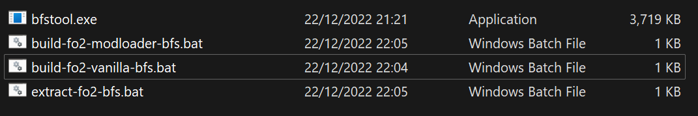
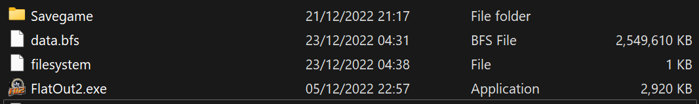

# Improving Load Times

!!! info

    This procedure provides the following benefits:  
        - Approx. 500MB Saved Drive Space.  
        - Improved file load times by ~2x.  
        - Cleans up game folder.  

!!! warning

    The BFS files produced by this method are incompatible with unmodified vanilla game.  

The FlatOut 2 Mod Loader makes use of custom BFS files, with a better compression algorithm (ZStd) that provides significant improvement in the speed of loading files from disk. 

More specifically, these BFS files are on average 75% of the size with data decompressed at around ~214% speed, compared to the unmodified files; leading to improved load times, especially on SSDs.  

This guide shows how to repack game's stock BFS files to use the new improved BFSes, and merge them into a single BFS.  

## Download The Tools

!!! info

    [Download my fork of BfsTool](https://cdn.discordapp.com/attachments/846790579542163467/1055952657006735360/bfstool.zip).



## Unpacking Game Files

!!! info

    Here we merge multiple BFSes into single data folder.  

Go to your game folder and drag files [in your game folder] over `extract-fo2-bfs.bat`
in the following order:  

- `fo2a.bfs`
- `fo2b.bfs`
- `fo2c.bfs`
- `patch1.bfs`

After unpacking all files you should have a `data` folder around 4GB.  

## Repacking Game Files

!!! info

    Repacking will take a while. Don't be impatient.  

Once unpacked, drag the `data` folder over `build-fo2-modloader-bfs.bat`. 
This will produce a file called `data.bfs`. Delete the original BFS files listed in unpacking section.  

Open `filesystem` file with a hex editor, and modify it so it looks like this:  

```
data.bfs
```

Open `patch` file and remove line with `patch1.bfs`. If this results in empty file, delete the file.

## Result

Your game folder should resemble something like the following:  

