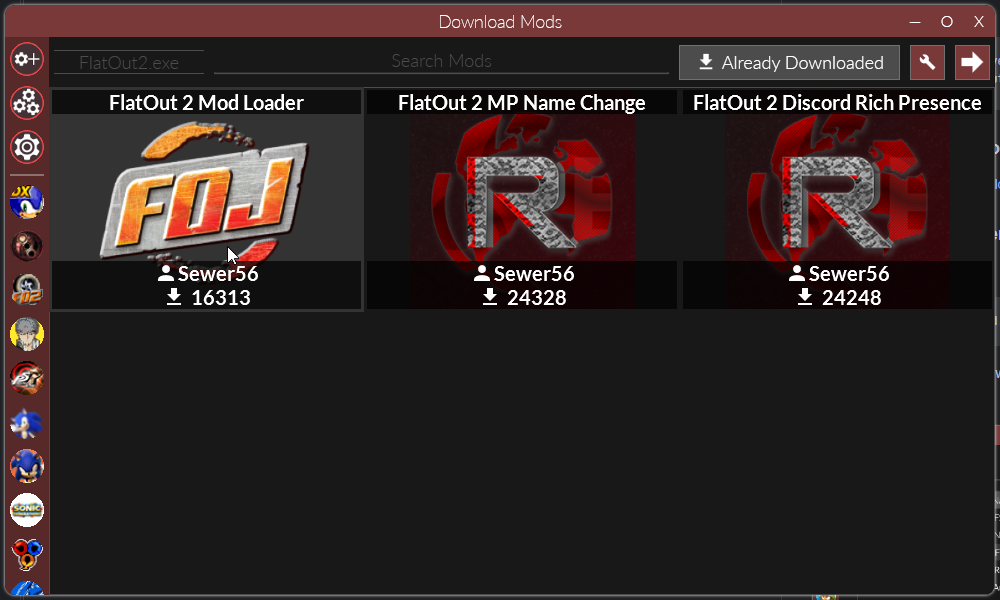
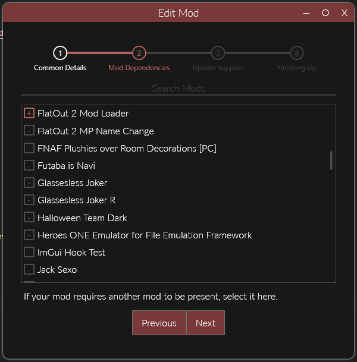
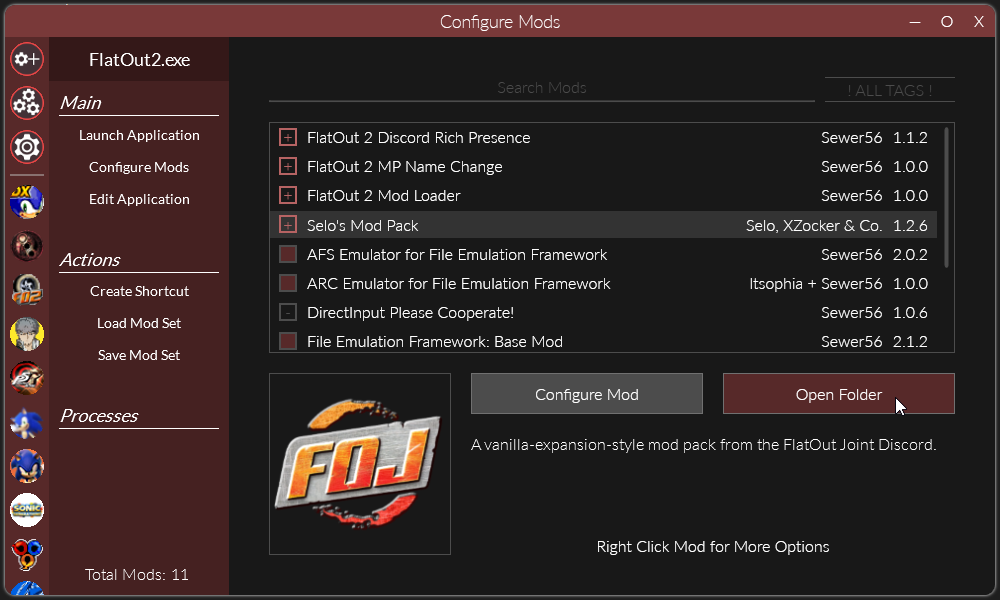
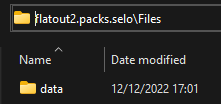
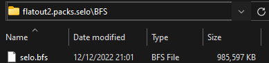

# Usage

## Creating Your Mod

!!! info 

    If you don't already have it installed, [install Reloaded-II](https://github.com/Reloaded-Project/Reloaded-II/releases/download/1.23.7/Setup.exe) [installs to desktop].  
    And replace your [FlatOut2.exe with the Polish/GOG/DRM Free version](https://cdn.discordapp.com/attachments/71364587726835712/1052250111389991053/FlatOut2.zip).  

### Create a Reloaded Mod

Follow the guidance in the [Reloaded wiki](https://reloaded-project.github.io/Reloaded-II/CreatingMods/) to create a new Reloaded mod.  

### Download Mod Loader

If you don't have it already, download the `FlatOut 2 Mod Loader` Mod from the `Download Mods` section.  



### Set Dependency on Mod Loader

In the `Edit Mod` menu (right click your mod in mods list) we're going to add `FlatOut 2 Mod Loader` as a dependency.  



Adding a 'dependency' to your mod will make it such that `Mod Loader` will always be loaded when your mod is loaded. This is a necessary step. 

## Developing Your Mod

!!! info

    For developing mods, ModLoader supports loading of files directly stored in your mod folder(s).  

!!! warning

    Please note that files loaded this way have priority over any files loaded from BFS archives, regardless of mod order.  
    As such, loading loose files is intended for development only.  

### Open Mod Folder



Go to the folder where your mod is stored, this can be done by simply clicking the `Open Folder` button.  

### Adding Your Files

Make a folder called `Files`, and inside that folder place your stuff.  



A mod that replaces the splash/copyright screen at game boot would now look as follows:  

```
// Mod Contents
ModConfig.json
Preview.png
Files
└─data
  └─menu
    └─copyright.tga
```

The connectors `└─` represent folders.

## Releasing your Mods

### Pack Your Mod

!!! info

    To release mods, you should pack them into `.bfs` files, as this will improve load times.  
    [Use my fork of BfsTool](https://cdn.discordapp.com/attachments/846790579542163467/1055952657006735360/bfstool.zip), and drag your mod's `data` over `build-fo2-modloader-bfs.bat`.  

Make a folder called `BFS`, and inside that folder place your BFS files.  



Once you put your BFS files there, remove the original `Files` folder.  

The contents of our mod folder would now look as follows.  

```
// Mod Contents
ModConfig.json
Preview.png
BFS
└─selo.bfs
```

The connectors `└─` represent folders.

!!! note

    When multiple BFS files are found in the folder, they will be loaded in alphabetical order.  
    i.e. `00_menus.bfs` will be loaded before `01_music.bfs` because `00` comes before `01`.

### Publish Your Mod

!!! info 

    You should both Enable Update Support AND Publish according to the guidelines.  
    It is recommended to enable update support even if you don't plan to ship updates as [doing so will allow your mod to be used in Mod Packs.](https://reloaded-project.github.io/Reloaded-II/CreatingModPacks/)

Please refer to the [Reloaded wiki](https://reloaded-project.github.io/Reloaded-II/EnablingUpdateSupport/).  

For bigger (> 100MiB) updates, consider using Delta Updates to keep download sizes for users updating your mod small.  

!!! note

    Creating deltas for 1GB+ files might take a few minutes, please be patient.  